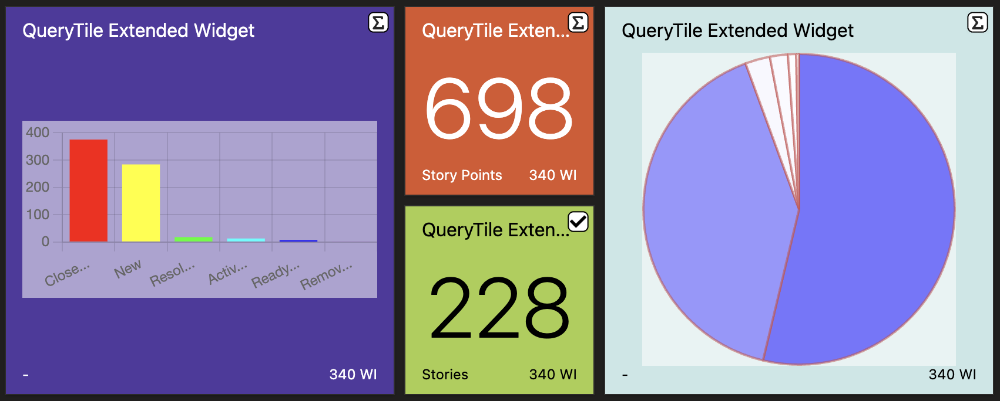
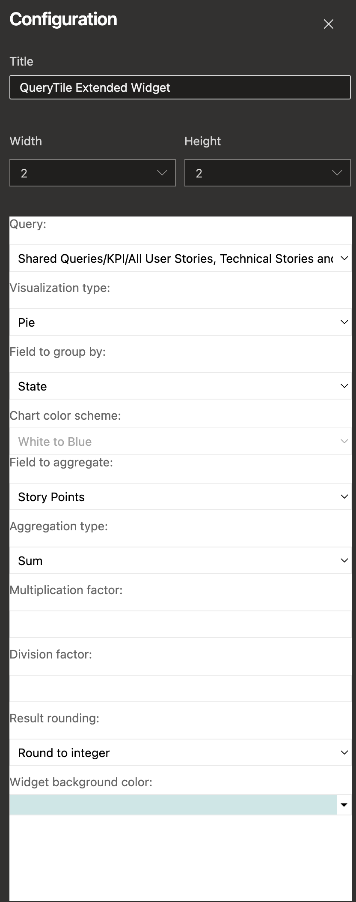

# QueryTile Extended

**Widget** for TFS and VSTS allowing to mimic the *QueryTile* widget with various types of visualizations and enhanced customization. Now, you can display your data in different visualization formats including:

- Number
- Bar
- Line
- Pie
- Donut
- Polar
- Radar

You can also choose the colors for the charts and group the data as needed. The available aggregation functions include:

- Sum
- Highest
- Lowest
- Average
- Count empty values
- Count non-empty values

## HowTo

First, take a look at the configuration:

Start by choosing a name for your widget, and a size (from 1x1 to 4x4).

Then select a public query with the Query dropdown.

Next, choose the type of visualization you want to use (number, bar, line, pie, donut, polar, or radar).

You can then select the field on which you want to apply an aggregation function. The field dropdown presents you with all integer or decimal fields configured on your project, even if the chosen query doesn't return them.

You can also choose the colors for the charts and decide how to group the data.

If needed, you can apply some multiplication or division factors (for days to hour conversion, for example).

By applying certain aggregation functions or division factors, you may end up with decimal values. To make the presentation cleaner, you can apply rounding.

Finally, you can set the unit of the aggregation result you will show, and the background color of the widget.

## Browser compatibility

The widget is working on :

- Arc Browser ❤️
- Chrome
- Firefox
- Edge

## Evolutions

If you have ideas for this widget to evolve, including new visualization types or other enhancements, don't be shy and contact me on [github](https://github.com/arsenikstiger/querytile-extended).

## License

The [code](https://github.com/arsenikstiger/querytile-extended) is open sourced under the [MIT license](license.md). We love and encourage community contributions.
